<br/>
<div align="center">
  <a href="https://github.com/PdgarHern/ReactWithRubyUsingPostregSQL">
    
  </a>
  <h3 align="center">Anime Odoo module</h3>
  <br/>
</div>

<details>
  <summary>Index</summary>
  <ol>
    <li>
      <a href="#odoo-custom-module">Odoo Custom Module</a>
      <ul>
        <li>
          <a href="#part-1">Part 1</a>
          <ul>
            <li>
              <a href="#requirements">Requirements</a>
            </li>
            <li>
              <a href="#how-it-works">How it works</a>
            </li>
          </ul>
        </li>
        <li>
          <a href="#part-2">Part 2</a>
          <ul>
            <li>
              <a href="#reports">Reports</a>
            </li>
            <li>
              <a href="#styling">Styling</a>
            </li>
            <li>
              <a href="#third-parties-modules">Third parties modules</a>
              <ul>
                <li>
                  <a href="#google-maps">Google Maps</a>
                </li>
                <li>
                  <a href="#query-deluxe">Query Deluxe</a>
                </li>
              </ul>
            </li>
          </ul>
        </li>
      </ul>
    </li>
  </ol>
</details>

# Odoo Custom Module

## Part 1
Welcome to my Odoo custom module.<br/>
<br/>
My job was to create a module about the same topic and with the same functionalities as another project that I was doing.<br/>
(See the other project <a href="https://github.com/PdgarHern/ReactWithRubyUsingPostregSQL">here</a>)<br/>
<br/>
For this project I also had some requirements to match. So let me explain a bit how all works.<br/>

### Requirements
<ol>
  <li>New classes for the new module.</li>
  <li>New views for the new module.</li>
  <li>Inherited classes from other Odoo module existing class.</li>
  <li>Inherited views in other views already existing from other Odoo module.</li>
  <li>Actions, Menu elements and Group Rights.</li>
  <li>Inclusion of One2many and Many2one fields.</li>
  <li>Adapt some Odoo module functionality to the new module.</li>
  <li>Workflow creation</li>
  <li>Some personal addition to the module</li>
</ol>

### How it works
First, we have to install the module.<br/>
<div align="center">
  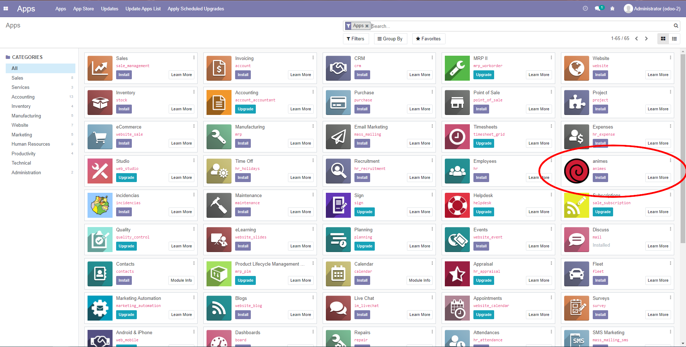
</div>

###
This will not just install our module, it will also install another modules like *Project* or *Invoicing* that we'll need to use our module.<br/>
<div align="center">
  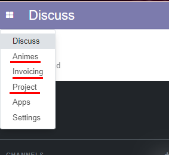
</div>

###
When you first enter the *Animes* module, you'll be in *anime*.<br/>
So, let's create a new one.<br/>
<div align="center">
  
</div>

###
Now, you may start to notice a few things.<br/>
Here, I've integrated a *mail box* from Odoo. This is made to match two of the requirements:
<ol>
  <li>Integrate an existing Odoo functionality</li>
  <li>The workflow</li>
</ol>
<div align="center">
  
</div>

###
So, if we hit the *Save* button a message (an activity, actually) will appear to the *Administrator* user.
<div align="center">
  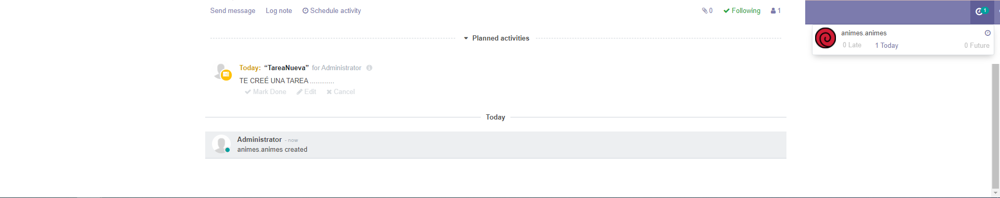
</div>

###
With an *anime* created, we now can create *actors* and *characters* associated to that *anime*.<br/>
Both can be created the same two ways:
<ol>
  <li>From the anime itself.</li>
  <br/>
  <div align="center">
    
  </div>
  <li>Going to its own page.</li>
  <br/>
  <div align="center">
    
    
  </div>
</ol>

###
Either way, you'll end up with the same result.
<div align="center">
  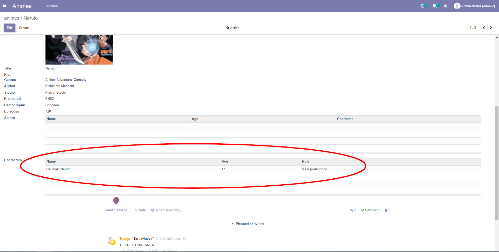
  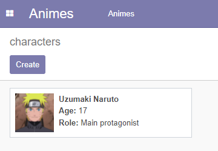
</div>

###
Thus far, we've seen some new classes and views.<br/>
We've seen other modules being inherited and adding new funcionalities.<br/>
As well as the Actions, Menu elements, the inclusion of One2Many and Many2One fields and the workflow (We still have to see an extra detail on this last one).<br/>
<br/>
So, our next stop is the *Group Rights*.<br/>
<div align="center">
  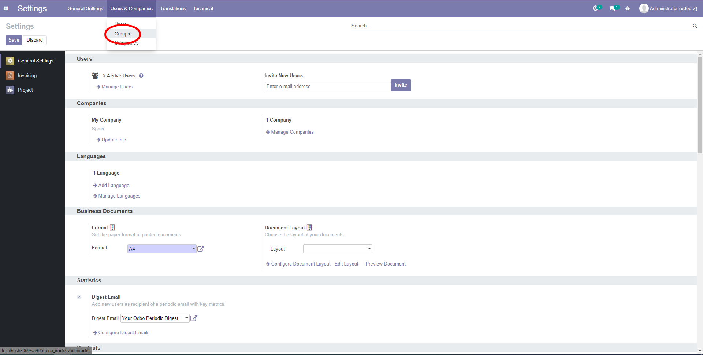
</div>

###
The module has two groups with different *access rights*. I encourage you to look up what *rigts* each of them gives you instead of me telling it here.
<div align="center">
  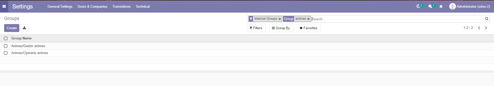
</div>

###
We have two requirements left (one of them being the *personal addition*) and they're actually related.<br/>
But first, let's see that little detail I mencioned about the workflow.<br/>
That has to be with the *Project* module, so let's head there.<br/>
<div align="center">
  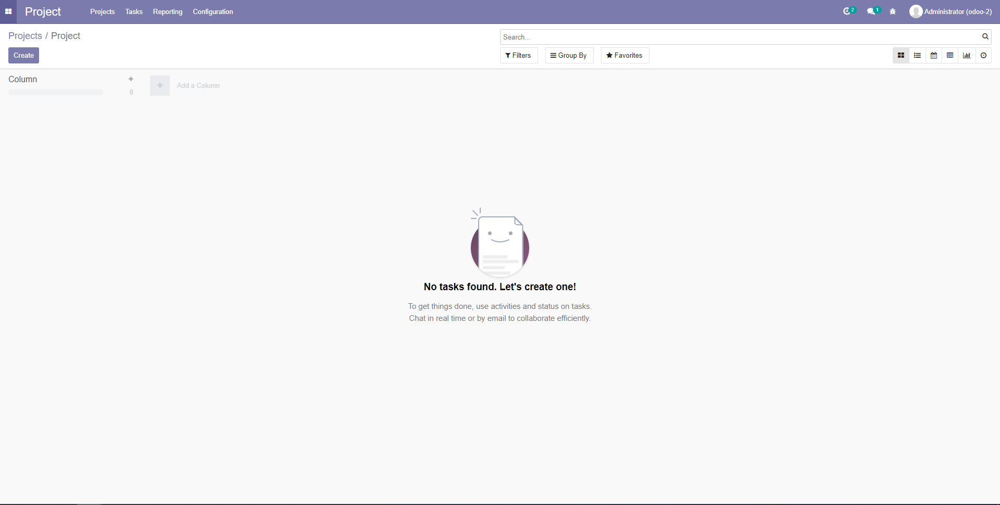
</div>

###
As you can see, I already have a project that we are going to use.<br/>
If we now create a new *task* for our project, it will automaticly generate an activity to the user the *task* is assigned to.<br/>
<div align="center">
  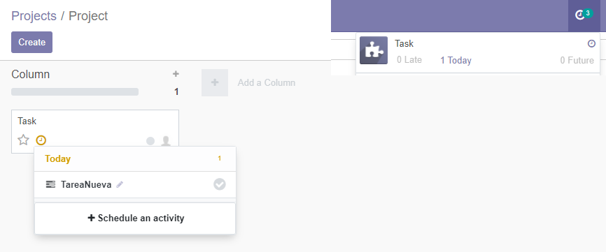
</div>
<br/>

###
This is posible because of <a href="animes/models/automatic_activity.py">this</a> file from our module.<br/>
In this file, we create a new class that inherites from ```project.task``` and we generate the code necessary to achieve what we want.<br/>
So, enough said for this little detail.<br/>
<br/>
Let's now talk about the last two things.<br/>
I found myself with the need to create an *inherited view* for some other *Odoo module*. And I also had to create something out of my mind.<br/>
My original *Animes* project mencioned before had these 'Favourite' lists.<br/>
Each user could add an *anime* to his favourites, or delete it.<br/>
<br/>
So, I decided to create a *Many2many* relathionship as my personal contribution. I just needed users.<br/>
For that, I used the *Invoicing* module, which has *customers* that I will use as my users.<br/>
This way, I also covered the point of creating an *inherited view* on an existing module, because the *animes* agregated to 'Favourites' will appear on every *Invoicing Customer*.
<div align="center">
  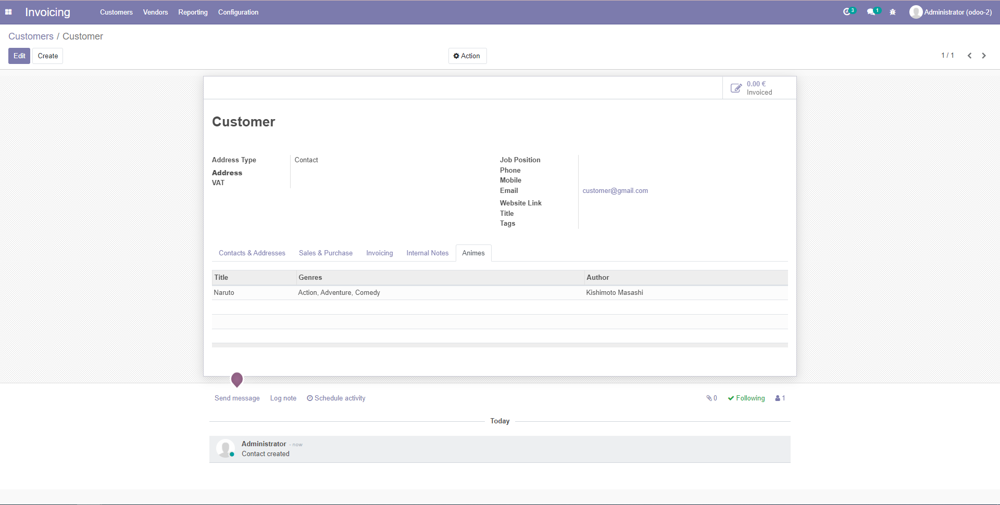
</div>

###
With that, we've finished covering all the functionalities of my new module.<br/>
I hope you have enjoyed it or that it has been useful in some way.<br/>

## Part 2
We have some new things added in our module.<br/>
<br/>
I will now explain these additions, where to found them and how they work.<br/>

### Reports
Special reports have been created for the *Animes* of our application.

###
Now, you can go to the *form view* of any anime and click *"Print"*.

###
Select *"Reporte Animes"* and this will show you the following report:<br/>
<br/>
<div align="center">
  
</div>
<div align="center">
  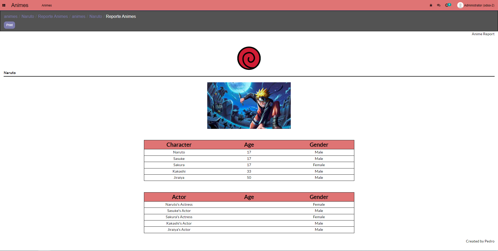
</div>

###
Our report has a header and a footer.<br/>
Also, it shows the app logo, the poster of the anime and its name.<br/>
<br/>
Then, we have two tables (one for the characters and other for the actors).<br/>
Each "td" of the tables has a hoover property so the color changes when placing your cursor over it.

### Styling
Some styles have been changed.<br/>
Our app itself now looks different. Now it's like Odoo has its own dark mode.<br/>
<div align="center">
  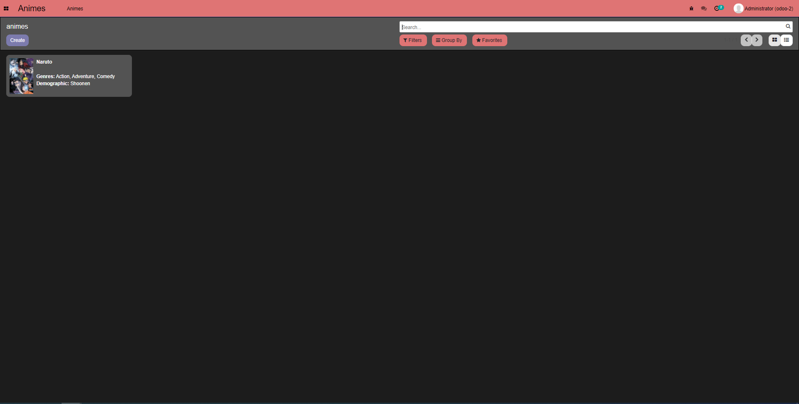
</div>
<div align="center">
  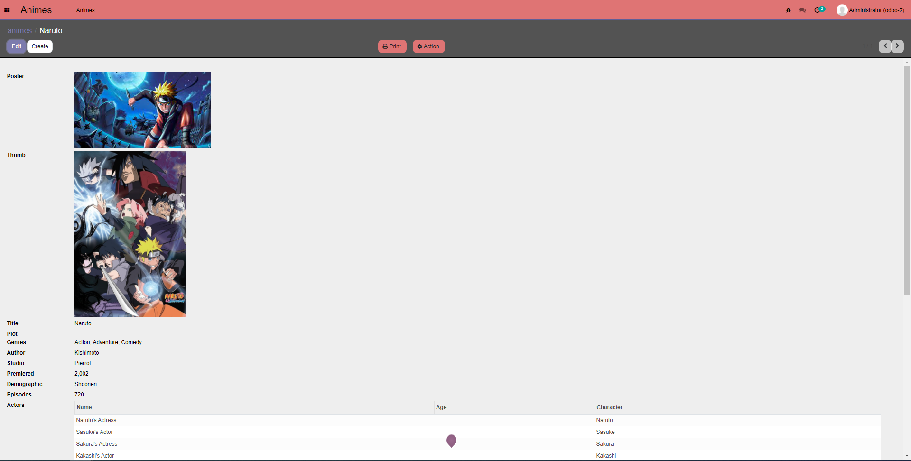
</div>

###
Also, other Odoo aspects have changed as well. Like the "App" page.<br/>
<div align="center">
  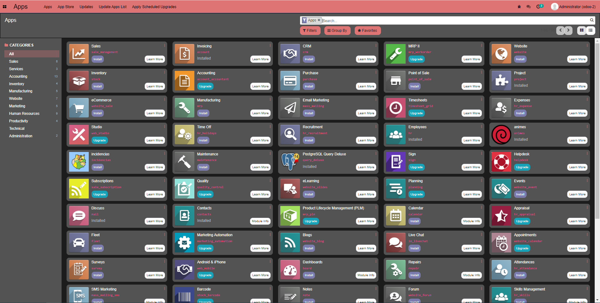
</div>

###
Lastly, a detail has been added to every *kanbas view*. That's a transform when hoover.<br/>
<br/>
Hoover off (on "Employees"):<br/>
<div align="center">
  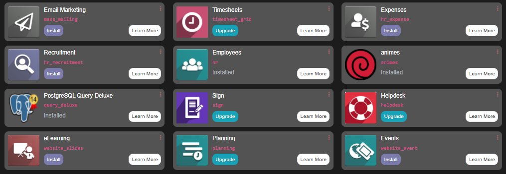
</div>
<br/>
Hoover on (on "Employees"):<br/>
<div align="center">
  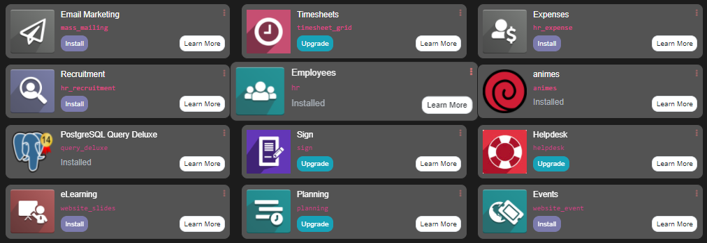
</div>


### Third parties modules
The project includes three *Third parties modules*.

#### Google Maps
This is the first module I included and doesn't work properly as it needs more dependencies to do so. The only thing you could achieve is to get your exact location when creating a "Contact" in the *Invoice* app, for example.

#### Query Deluxe

